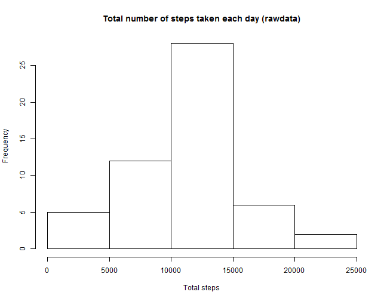
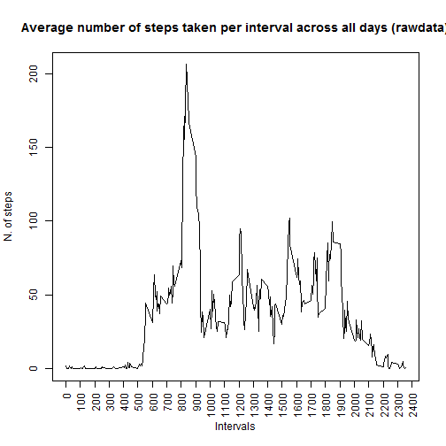

## Introduction 

The variables included in this dataset are:

- steps:      Number of steps taking in a 5-minute interval (missing values are coded as NA)
- date:       The date on which the measurement was taken in YYYY-MM-DD format
- interval:   Identifier for the 5-minute interval in which measurement was taken

The dataset is stored in a comma-separated-value (CSV) file and there are a total of 17,568 observations in this dataset.

## Loading and preprocessing the data


```r
library(data.table)
library(dplyr)
unzip(zipfile = "activity.zip")
adata <- read.csv(file = "activity.csv", header=TRUE)
adatadt <- data.table(adata)
```

## What is mean total number of steps taken per day?

For this part of the assignment, you can ignore the missing values in the dataset.  

1. **Calculate the total number of steps taken per day**


```r
total_xday <- adatadt[,sum(steps), by = date]
setnames(total_xday,"V1","TotalSteps")
head(total_xday)
```

```
##          date TotalSteps
## 1: 2012-10-01         NA
## 2: 2012-10-02        126
## 3: 2012-10-03      11352
## 4: 2012-10-04      12116
## 5: 2012-10-05      13294
## 6: 2012-10-06      15420
```


2. **If you do not understand the difference between a histogram and a barplot, research the difference between them. Make a histogram of the total number of steps taken each day**  


```r
hist(total_xday$TotalSteps, main = "Total number of steps taken each day", xlab = "Total steps")
```

 

3. **Calculate and report the mean and median of the total number of steps taken per day**


```r
mean_totxday <- mean(total_xday$TotalSteps, na.rm = T)
median_totxday <- median(total_xday$TotalSteps, na.rm = T)
```

The mean total number of steps taken per day and rounded to integer is 10766 whereas the median is 10765.

## What is the average daily activity pattern?

1. **Make a time series plot (i.e. type = "l") of the 5-minute interval (x-axis) and the average number of steps taken, averaged across all days (y-axis)**


```r
mean_x_int <- adatadt[,mean(steps, na.rm = T), by = interval]
plot(mean_x_int$interval, mean_x_int$V1, type = "l", xlab = "Time (5 min Interval)", ylab = "Average number of steps taken, averaged across all days", xaxt = "n", main = "Average number of steps (in 5 min interval) across all days")
axis(1, at = seq(0, 2400, by = 200), las=2)
```

 

2. **Which 5-minute interval, on average across all the days in the dataset, contains the maximum number of steps?**

```r
maxvector <- mean_x_int[,V1==max(mean_x_int$V1)]
maxinterval <- as.matrix(mean_x_int[maxvector,])[1,1]
```

The interval in which there is the maximum number of steps averaged across all days is: 835

## Imputing missing values

Note that there are a number of days/intervals where there are missing values (coded as NA). The presence of missing days may introduce bias into some calculations or summaries of the data.  

1. Calculate and report the total number of missing values in the dataset (i.e. the total number of rows with NAs)  


```r
table(is.na(adata))
```

```
## 
## FALSE  TRUE 
## 50400  2304
```


2. Devise a strategy for filling in all of the missing values in the dataset. The strategy does not need to be sophisticated. For example, you could use the mean/median for that day, or the mean for that 5-minute interval, etc.


3. Create a new dataset that is equal to the original dataset but with the missing data filled in.

4. Make a histogram of the total number of steps taken each day and Calculate and report the mean and median total number of steps taken per day. Do these values differ from the estimates from the first part of the assignment? What is the impact of imputing missing data on the estimates of the total daily number of steps?

## Are there differences in activity patterns between weekdays and weekends?
